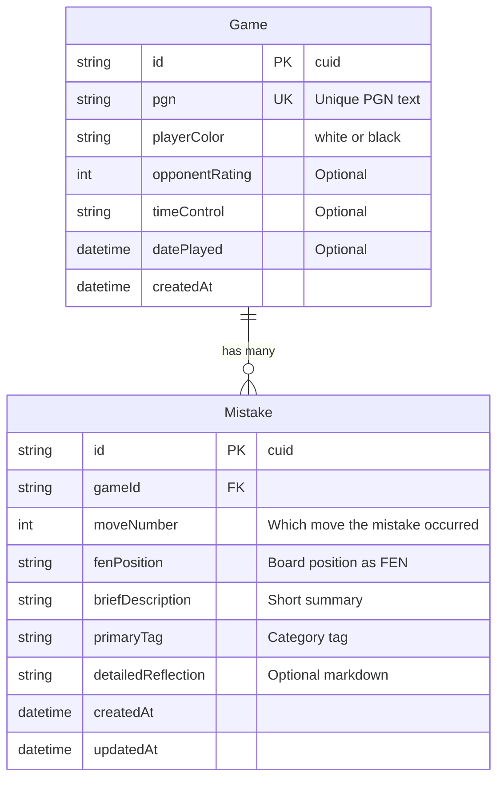
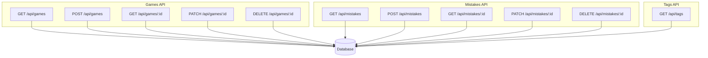
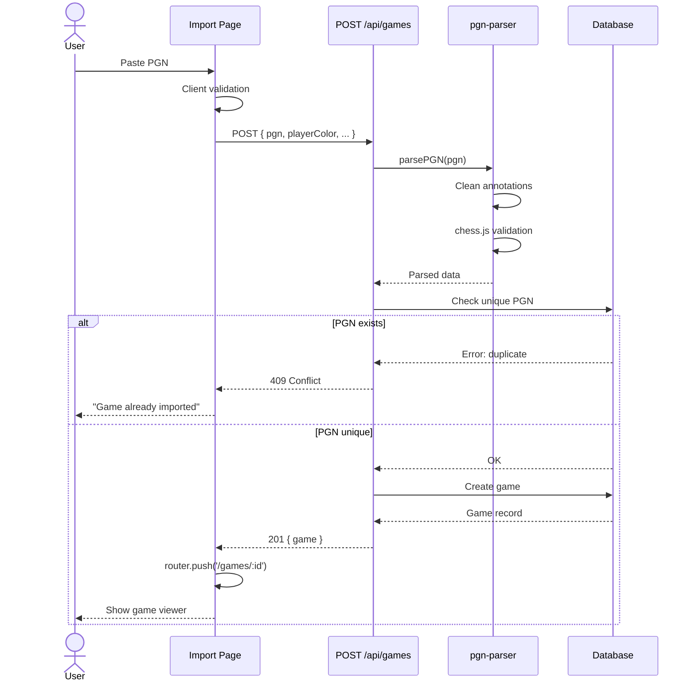
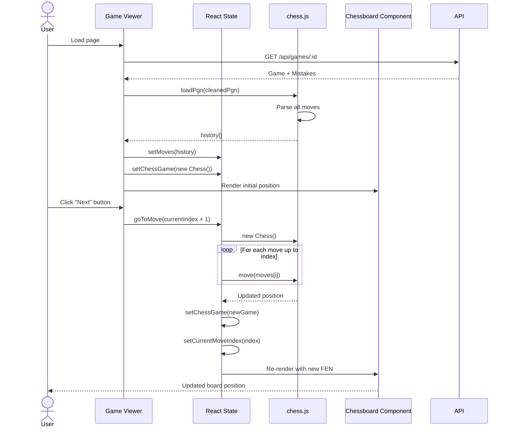
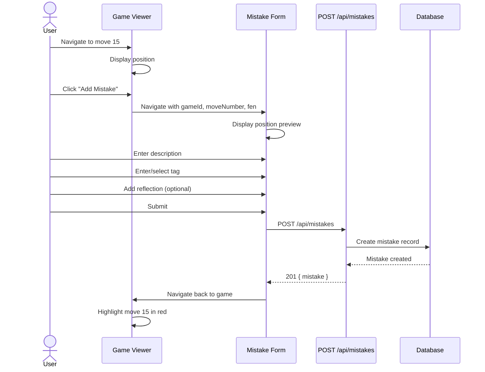
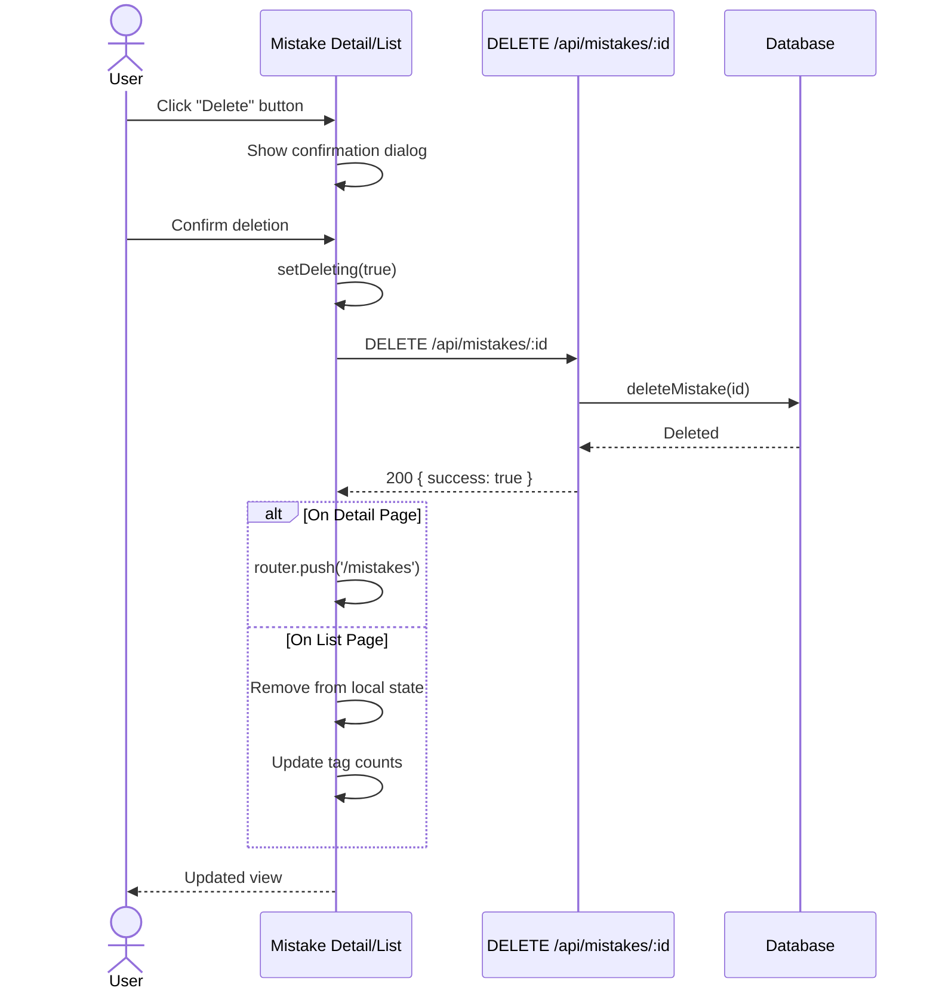
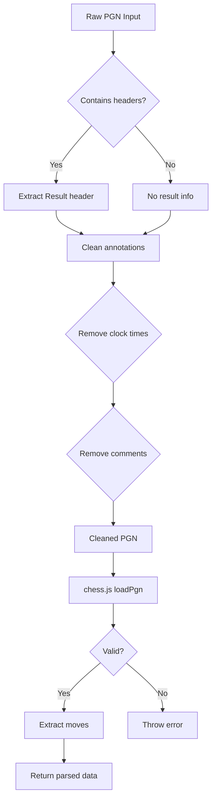
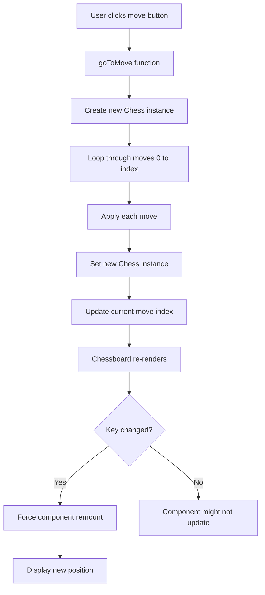
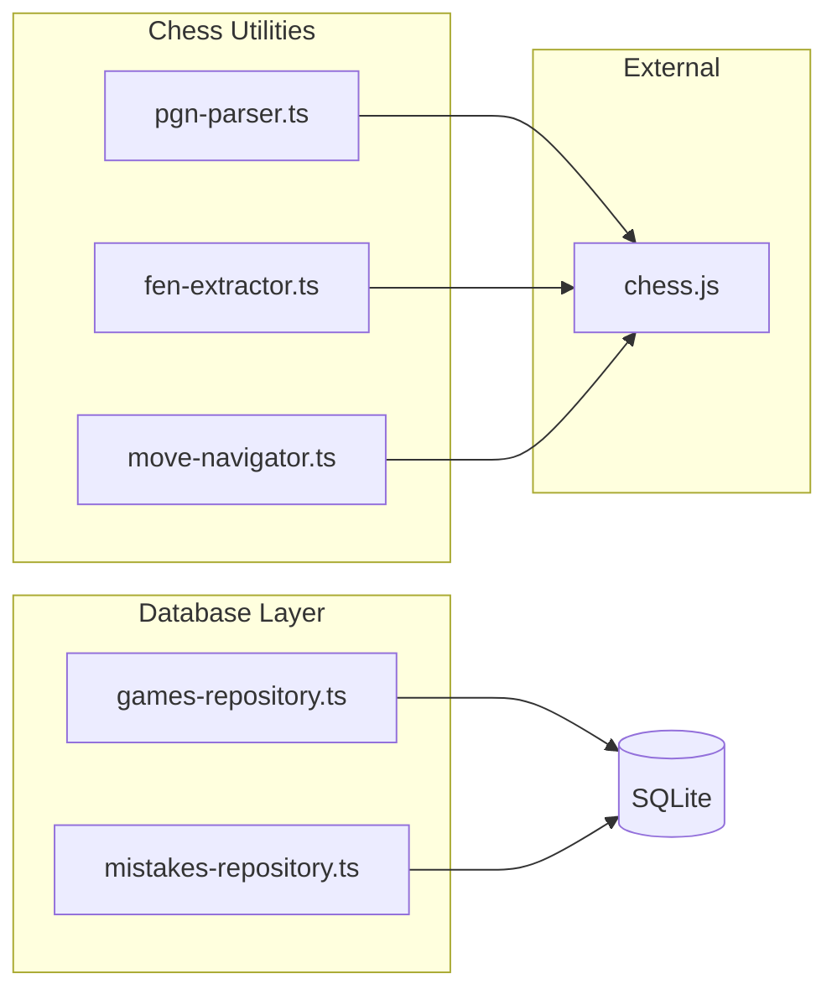

# Chess Mistake Journal - Architecture Documentation

> **Purpose**: This document provides a comprehensive overview of the application's architecture, data flows, and key design decisions. It's intended for both human developers and AI assistants working on this codebase.

## Table of Contents

1. [System Overview](#system-overview)
2. [Database Schema](#database-schema)
3. [API Endpoints](#api-endpoints)
4. [Data Flow Diagrams](#data-flow-diagrams)
5. [Key Workflows](#key-workflows)
6. [Chess Logic & Utilities](#chess-logic--utilities)
7. [Frontend Pages](#frontend-pages)

---

## System Overview

The Chess Mistake Journal is a Next.js application for tracking and analyzing chess mistakes. Users can:

- Import games via PGN
- Navigate through game moves with a visual board
- Record mistakes at specific positions with tags and reflections
- Browse and filter mistakes by tags
- Delete mistakes

**Tech Stack**:

- **Framework**: Next.js 16 (App Router)
- **Database**: SQLite with Prisma ORM
- **Chess Engine**: chess.js
- **Chess UI**: react-chessboard
- **Styling**: Tailwind CSS
- **TypeScript**: Full type safety throughout

---

## Database Schema



### Key Design Decisions:

1. **PGN as Unique Key**: Each game's PGN is unique to prevent duplicate imports
2. **Cascade Delete**: Deleting a game deletes all its mistakes (`onDelete: Cascade`)
3. **FEN Storage**: Each mistake stores the exact board position as FEN for display
4. **Indexing**:
   - `datePlayed` on Game for chronological sorting
   - `gameId`, `primaryTag`, `createdAt` on Mistake for efficient filtering

---

## API Endpoints



### API Details

#### Games Endpoints

| Method | Path             | Description                        | Request                                                            | Response                                   |
| ------ | ---------------- | ---------------------------------- | ------------------------------------------------------------------ | ------------------------------------------ |
| GET    | `/api/games`     | List all games                     | -                                                                  | `{ games: Game[] }`                        |
| POST   | `/api/games`     | Create game from PGN               | `{ pgn, playerColor, opponentRating?, timeControl?, datePlayed? }` | `{ game: Game }`                           |
| GET    | `/api/games/:id` | Get single game with mistakes      | -                                                                  | `{ game: Game & { mistakes: Mistake[] } }` |
| PATCH  | `/api/games/:id` | Update game metadata               | `{ playerColor?, opponentRating?, timeControl?, datePlayed? }`     | `{ game: Game }`                           |
| DELETE | `/api/games/:id` | Delete game (cascades to mistakes) | -                                                                  | `{ success: true }`                        |

#### Mistakes Endpoints

| Method | Path                | Description                      | Request                                                                                  | Response                                     |
| ------ | ------------------- | -------------------------------- | ---------------------------------------------------------------------------------------- | -------------------------------------------- |
| GET    | `/api/mistakes`     | List all mistakes with game data | -                                                                                        | `{ mistakes: (Mistake & { game: Game })[] }` |
| POST   | `/api/mistakes`     | Create mistake                   | `{ gameId, moveNumber, fenPosition, briefDescription, primaryTag, detailedReflection? }` | `{ mistake: Mistake }`                       |
| GET    | `/api/mistakes/:id` | Get single mistake with game     | -                                                                                        | `{ mistake: Mistake & { game: Game } }`      |
| PATCH  | `/api/mistakes/:id` | Update mistake                   | `{ briefDescription?, primaryTag?, detailedReflection? }`                                | `{ mistake: Mistake }`                       |
| DELETE | `/api/mistakes/:id` | Delete mistake                   | -                                                                                        | `{ success: true }`                          |

#### Tags Endpoint

| Method | Path        | Description         | Response             |
| ------ | ----------- | ------------------- | -------------------- |
| GET    | `/api/tags` | Get all unique tags | `{ tags: string[] }` |

---

## Data Flow Diagrams

### 1. Game Import Flow



### 2. Game Viewer Navigation Flow



**Key Implementation Detail**: The board uses `key={chessGame.fen()}` to force React to re-render when the position changes, ensuring the chessboard updates correctly.

### 3. Mistake Recording Flow



### 4. Mistake Deletion Flow



---

## Key Workflows

### PGN Parsing & Validation



**Location**: `lib/chess/pgn-parser.ts`

**Cleaning Steps**:

1. Remove clock annotations: `{ [%clk 0:03:00] }`
2. Remove evaluation comments: `{ [%eval 0.5] }`
3. Remove opening names and other bracketed data
4. Trim whitespace

### Move Navigation Logic



**Location**: `app/games/[id]/page.tsx`

**Critical Implementation**:

```typescript
// The key prop forces React to remount the component when position changes
<Chessboard
  key={chessGame.fen()}  // Forces re-render on position change
  options={{
    position: chessGame.fen(),
    allowDragging: false,
  }}
/>
```

---

## Chess Logic & Utilities

### Module Overview



### pgn-parser.ts

**Purpose**: Parse and validate PGN strings

**Key Functions**:

- `parsePGN(pgn: string)`: Main parsing function
  - Cleans annotations
  - Validates with chess.js
  - Extracts game result from headers
  - Returns structured data

**Test Coverage**: ✅ Full unit tests in `__tests__/lib/chess/pgn-parser.test.ts`

### fen-extractor.ts

**Purpose**: Extract FEN positions from specific moves in a PGN

**Key Functions**:

- `getFenAtMove(pgn: string, moveNumber: number)`: Get position after move N
  - Parses PGN
  - Replays moves up to target
  - Returns FEN string

**Test Coverage**: ✅ Full unit tests in `__tests__/lib/chess/fen-extractor.test.ts`

### move-navigator.ts

**Purpose**: Navigate through game positions

**Key Functions**:

- `getMoveHistory(pgn: string)`: Get array of all moves
- `getPositionAtMove(pgn: string, moveIndex: number)`: Get board state at index

**Test Coverage**: ✅ Full unit tests in `__tests__/lib/chess/move-navigator.test.ts`

### Repository Pattern

Both `games-repository.ts` and `mistakes-repository.ts` follow a repository pattern:

**Benefits**:

1. Separates data access from API logic
2. Easier to test (can mock repositories)
3. Consistent error handling
4. Single source of truth for queries

**Example**:

```typescript
// games-repository.ts
export async function createGame(prisma: PrismaClient, data: CreateGameInput): Promise<Game> {
  return prisma.game.create({ data });
}

// Used in API route
const game = await gamesRepo.createGame(prisma, gameData);
```

---

## Frontend Architecture

### Page Structure

```mermaid
graph TD
    A[/ Root] --> B[/games]
    A --> C[/mistakes]

    B --> B1[/games/:id - Game Viewer]

    C --> C1[/mistakes - List All]
    C --> C2[/mistakes/:id - Detail View]
    C --> C3[/mistakes/new - Create Form]
```

### State Management

**Game Viewer State**:

- `chessGame`: Current chess.js instance
- `currentMoveIndex`: Which move is displayed (0-indexed, 0 = start position)
- `moves`: Array of all moves from PGN

**Mistakes List State**:

- `mistakes`: All mistakes with game data
- `selectedTag`: Current filter
- `deletingId`: Track which mistake is being deleted

**Mistake Form URL Parameters**:

- `gameId`: Which game the mistake belongs to
- `moveNumber`: Which move
- `fen`: Board position (passed from game viewer)

---

## Design Decisions & Trade-offs

### 1. PGN as Unique Constraint

**Decision**: Use PGN text as unique key, not game metadata

**Rationale**:

- Two games with same players/date/result could be different games
- PGN contains the complete game record
- Prevents accidental duplicate imports
- Simple to check before insert

**Trade-off**: Large text field as unique key (not ideal for performance at scale)

### 2. Storing FEN with Each Mistake

**Decision**: Store `fenPosition` on each Mistake, not just `moveNumber`

**Rationale**:

- Direct display without replaying game
- Protects against PGN modifications
- Faster queries (no need to parse PGN)

**Trade-off**: Redundant data storage

### 3. Repository Pattern

**Decision**: Abstract database access into repository modules

**Rationale**:

- Testability
- Consistency
- Easier to switch ORMs/databases
- Clear separation of concerns

**Trade-off**: Extra abstraction layer

### 4. Client-Side Move Navigation

**Decision**: Use chess.js on the client for move navigation, not server

**Rationale**:

- Instant UI updates
- No API calls for each move
- Works offline once game is loaded

**Trade-off**: Larger bundle size (chess.js is ~200KB)

### 5. SQLite Database

**Decision**: Use SQLite instead of PostgreSQL/MySQL

**Rationale**:

- Simple deployment (no separate DB server)
- Perfect for single-user journal
- Fast for small datasets
- Easy backups (single file)

**Trade-off**: Not suitable for multi-user deployment

---

## Testing Strategy

### Unit Tests (Implemented)

- ✅ PGN Parser (`pgn-parser.test.ts`)
- ✅ FEN Extractor (`fen-extractor.test.ts`)
- ✅ Move Navigator (`move-navigator.test.ts`)

**Test Philosophy** (from development-rules.md):

- Focus on core chess logic
- Test edge cases (empty games, invalid positions)
- Behavioral tests, not brittle implementation tests
- No UI testing (too brittle)

### Integration Tests (Not Yet Implemented)

Future areas to test:

- API endpoint contracts
- Repository CRUD operations
- PGN import end-to-end

---

## Future Considerations

### Scalability

Current limitations if scaling to multi-user:

1. SQLite → Need PostgreSQL
2. No authentication
3. No multi-tenancy
4. File-based storage

### Performance

Potential bottlenecks:

1. Large PGN parsing on import
2. Listing all games/mistakes without pagination
3. Move list rendering for 100+ move games

### Features Not Yet Implemented

Ideas for future development:

- Game analysis integration (Stockfish)
- Spaced repetition for mistakes
- Statistics dashboard
- Export mistakes as PDF
- Opening repertoire tracker

---

## Known Issues & Solutions

### React Chessboard Not Re-rendering

**Issue**: The `react-chessboard` v5.8.3 component with React 19 doesn't automatically re-render when position prop changes.

**Solution**: Use `key={chessGame.fen()}` on the `<Chessboard>` component to force remounting when position changes.

**Location**: `app/games/[id]/page.tsx`

---

**Last Updated**: 2025-11-05
**Maintainer**: This document should be updated whenever significant architectural changes are made.
